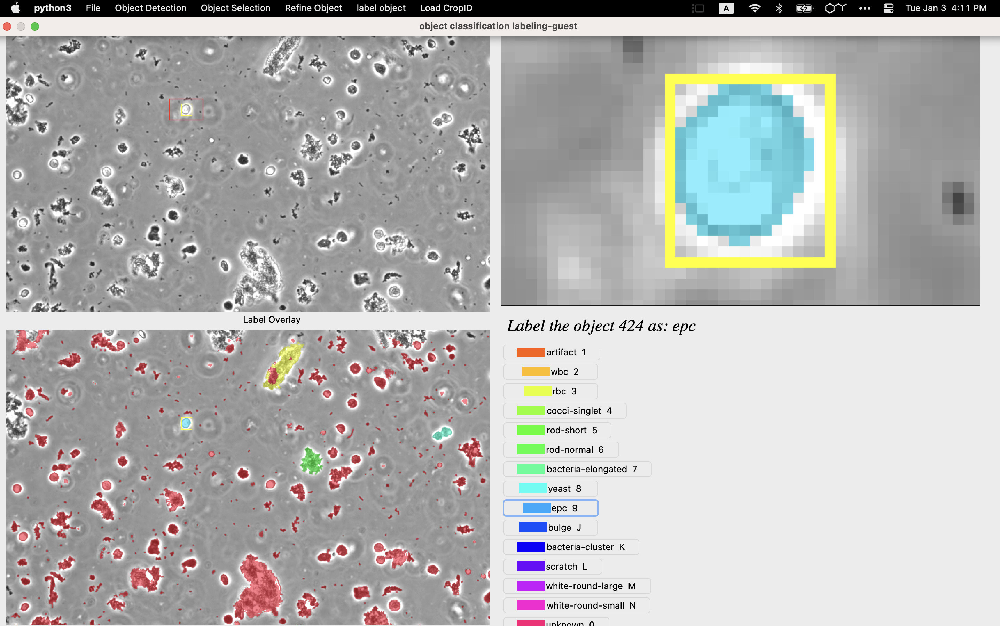

# GUI labeling for semantic segmentaiton

This GUI is used for object labeling and refimenent. If only a portion of the image needs to be labeled, state the coordinates in the crop_ID.pkl.
The model is based on the semantic segmentation model. You may update the weights of the model 22-06-26-13-03-50.pkl later if the active learning is applied.

## Description

Here is the link of the youtube: https://youtu.be/Pc0ZpQPgfX4 

## Getting Started



### Dependencies

* numpy
* tkinter
* tkmacosx (this only exits in the MacOS)
* PIL
* pickle
* matplotlib
* os
* shutil
* shapely
* ...
* mac os

### Installing
* Download this code and install all the packages that are needed
* Step-by-step bullets
```
python3 test.py
```

### Executing program
*  Go to the "File", login as your usename and select the image you want. If no username is entered, you will be loging as "Guest". If the username is in the template, it may automatically have a different filter, class name for you to label. The filter usually will only show several class with a probablity range in the predicted image. 

*  Go to the "Object Detection", detect object by applying the semantic segmentaiton model prediciton on the original image. And turn each object into red for you to label.

* * "Define the filter", by checking the box and enter the minimum (> 0) and maximum probability in the pop out window. The filter will only show selected class of object for you to label.
* * "Restore all object" is to show all the obejct. It has the same function with the button "filter off".
* * "Predicted object" is to show the model prediction on each class
* * "Predicted object" and then "Define the filter" will show the object with the expected class in the model prediciton.

* "Object selction", by clicking on the object and press "crontrol". 
Choose the color you want, and overlay it by "shift". 
To cancel the overlay color, use "command" + "z".
* * Go through each obejct by pressing the "left arrow" or "right arrow". Make sure you sort the object by size or id firstly.
* * Here is a trick to find the smallest object, click on the largest object, sort all the objects by size, and press the left arrow.

* Go to the "regfine object" to modify the shape of the object. Be sure that you select adding/removing pixel before you draw an area to refine. Then "comand" + "s" will show the refined shape. To recover the original shape, press "command" + "u".

* If you would like to label part of the image rather than the whole image, load the crop_ID.pkl by selecting the path. After finishing one portion labeling, go to the "up arrow" or "down arrow" to switch the crop_ID bounding box to label. You can also turn off this box.

(To edit the crop_ID.pkl or template.pkl in the image folder open the notebook edit_crop_ID_template.ipynb) 

## Short cut
| Menu Function  | MacOS | Win | 
| ------------- | ------------- | ------------- | 
| Select Object  | Crontrol  | Control/Windows |
| Overlay Object  | Shift  | Shift|
| Next Object | right arrow |right arrow |
| Previous Object | Left arrow | Left arrow |
| Undo Label | Command + z | Windows + z
| Add Pixel | Shift + "z+" |Shift + "z+" |
| Remove Pixel | - |  - |
| Undo Refine | Command + u | Windows + u
| Next crop box | down arrow | down arrow |
| Previous crop box | up arrow |up arrow |

The shortcut of label color may change and depends on the total number of the classes. For the class number larger than 9, alphabet will be represented the class number.

## Help
* To edit the crop_ID.pkl or template.pkl in the image folder open the notebook edit_crop_ID_template.ipynb
* The crop_ID.pkl is to state the coordinates where to crop for each image
* The template.pkl is to state the username template, for each user in the template, the label class and names, the filters of classes you wanna to show.


## Authors

Contributors names and contact info

names: Hang DENG
email: hang@phast.ai

## Version History

* 0.1
    * Initial Release in 01/03/2023

## License

No license is required
